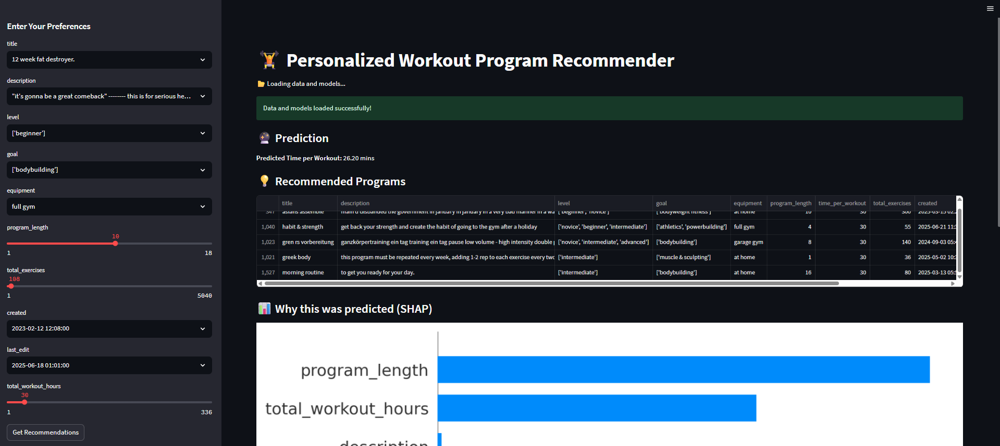
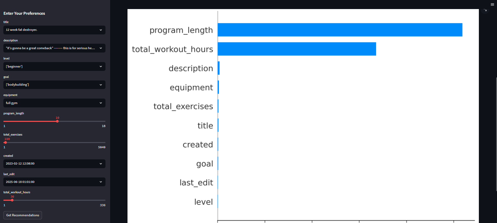

# 🏋️‍♂️ AI-Powered Fitness Program Recommendation System

[](https://www.python.org/)
[](https://streamlit.io/)
[](https://scikit-learn.org/stable/)
[](https://pandas.pydata.org/)
[](LICENSE)

An AI-powered fitness program recommendation system that predicts workout goals, workout durations, and recommends suitable fitness programs based on user preferences.

---
 
## 📑 Table of Contents
- [Overview](#overview)
- [Phases](#phases)
  - [Phase 1: Data Understanding & Cleaning](#phase-1-data-understanding--cleaning)
  - [Phase 2: Exploratory Data Analysis (EDA)](#phase-2-exploratory-data-analysis-eda)
  - [Phase 3: Machine Learning Models](#phase-3-machine-learning-models)
  - [Phase 4: Recommendation System](#phase-4-recommendation-system)
  - [Phase 5: Model Interpretability](#phase-5-model-interpretability)
  - [Phase 6: Deployment](#phase-6-deployment)
- [Installation](#installation)
- [Usage](#usage)
- [Screenshots](#screenshots)
- [Author](#author)
- [License](#license)

---

## 📌 Overview
This project uses **Machine Learning** to:
1. Predict a user's workout goal.
2. Estimate workout duration.
3. Recommend the most relevant fitness programs.
4. Provide model interpretability for transparency.

The app is built with **Streamlit** and integrates multiple phases of data science from cleaning to deployment.

---

## 🚀 Phases

### **Phase 1: Data Understanding & Cleaning**
- Load the dataset in **Pandas**.
- Inspect structure — column names, data types, and sample values.
- Handle missing values — drop, fill, or impute.
- Standardize categories — ensure uniform naming for goals, equipment, fitness levels.
- **Feature engineering:**
  - Encode categorical features (Label Encoding, One-Hot Encoding).
  - Create new features:
    - `total_workout_hours = program_length × time_per_workout`.
- **📌 Output:** Cleaned dataset ready for analysis.

---

### **Phase 2: Exploratory Data Analysis (EDA)**
- Descriptive statistics — mean, median, mode for numeric features.
- Goal distribution — bar plot of fitness goals.
- Workout duration trends — histograms, box plots.
- Correlation heatmap — find related variables.
- Equipment analysis — top equipment per goal.
- **📌 Output:** Visual insights for pattern understanding.

---

### **Phase 3: Machine Learning Models**
#### **3.1 Classification Model – Predict Goal Type**
- **Algorithms:** Random Forest, XGBoost, Logistic Regression.
- **Input:** `program_length`, `time_per_workout`, `equipment_used`, `fitness_level`, `total_exercises`.
- **Output:** Predicted goal type (muscle gain, weight loss, etc.).

#### **3.2 Regression Model – Predict Time per Workout**
- **Algorithms:** Linear Regression, Gradient Boosting.
- **Input:** `goal_type`, `program_length`, `equipment`, `fitness_level`, `total_exercises`.
- **Output:** Predicted workout duration (minutes).

- **📌 Output:** Trained ML models with accuracy and MAE scores.

---

### **Phase 4: Recommendation System**
#### **4.1 Content-Based Filtering**
- Compute cosine similarity between workout programs.
- Recommend similar programs to the user’s liked ones.

#### **4.2 Goal-Based Recommendations**
- Filter workouts based on:
  - User’s goal.
  - Available equipment.

- **📌 Output:** `recommend_workouts(user_preferences)` → top-N program suggestions.

---

### **Phase 5: Model Interpretability**
- Use **SHAP** or **LIME** to explain predictions.
- Show feature importance visually.
- Example: Fitness level contributes **40%** to certain predictions.
- **📌 Output:** Transparency for recommendations.

---

### **Phase 6: Deployment**
- **Streamlit App**:
  - User enters preferences.
  - App predicts goal & duration.
  - App recommends relevant programs.
- Deployed locally or on cloud.

---

## 💻 Installation
```bash
git clone https://github.com/your-username/ai-fitness-app.git
cd ai-fitness-app
pip install -r requirements.txt
````

---

## ▶️ Usage

```bash
streamlit run app.py
```

* Enter your workout preferences.
* View predictions & recommendations.
* Explore explanation of results.

---

## 📷 Screenshots

| App View                   | Recommendation View                   |
| -------------------------- | ------------------------------------- |
|  |  |

---

## ✍️ Author

**Mohammed Abu Hurer**
📧 Email: [mohammedabuhurer@gmail.com](mailto:mohammedabuhurer@gmail.com)

---

## 📜 License

This project is licensed under the **MIT License** - see the [LICENSE](LICENSE) file for details.

---
